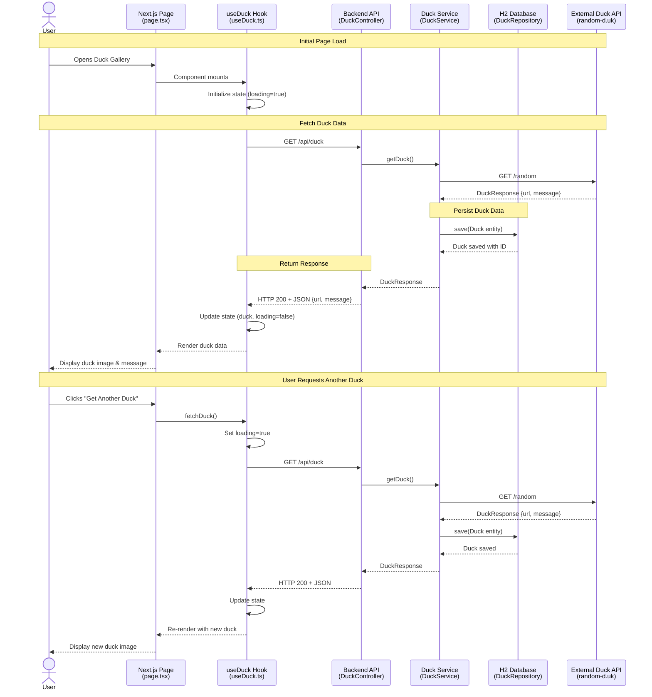

# Duck Gallery - End-to-End Flow Diagram

This document visualizes the complete data flow for the Duck Gallery application, showing interactions between the user, frontend (Next.js), backend (Spring Boot), database (H2), and external API.

## Overview

The Duck Gallery application demonstrates a full-stack flow where:
- Users interact with a Next.js 16 frontend built with React 19
- Frontend communicates with a Spring Boot 4 REST API
- Backend fetches duck images from an external Random Duck API
- Data is persisted in an H2 in-memory database
- Results are displayed to the user with a responsive UI

## Sequence Diagram

## Key Participants

### Frontend Components
- **page.tsx**: Main application page that renders the duck gallery UI
- **useDuck Hook**: Custom React hook managing duck data state, API calls, and loading/error states

### Backend Components
- **DuckController**: REST controller exposing `/api/duck` endpoint with CORS support for frontend
- **DuckService**: Business logic layer that orchestrates external API calls and database persistence
- **DuckRepository**: Spring Data JPA repository for persisting Duck entities

### External Systems
- **H2 Database**: In-memory database storing historical duck records
- **Random Duck API**: External service providing random duck images and messages

## Data Flow Steps

### 1. User Interaction & Component Initialization
- User navigates to the Duck Gallery (`http://localhost:3000`)
- React page component mounts and initializes the `useDuck` hook
- Hook sets initial loading state to `true`
- `useEffect` triggers automatic fetch on mount

### 2. Frontend to Backend Communication
- `useDuck` hook calls `fetchDuck()` function
- Sends HTTP GET request to `http://localhost:8080/api/duck`
- Request passes through CORS validation (allowed origin: `http://localhost:3000`)

### 3. Backend Processing
- `DuckController` receives the request at `@GetMapping /api/duck`
- Controller delegates to `DuckService.getRandomDuck()`
- Service uses `RestClient` to call external Random Duck API at configured URL
- External API returns JSON with duck image URL and message

### 4. Data Persistence
- Service creates a new `Duck` entity with URL and message
- Entity automatically gets `createdAt` timestamp
- `DuckRepository` persists entity to H2 database with auto-generated ID

### 5. Response & UI Update
- Service returns `DuckResponse` record to controller
- Controller returns HTTP 200 with JSON payload
- Frontend hook receives response and updates state
- React component re-renders with new duck data
- UI displays duck image, message, and enables "Get Another Duck" button

### 6. Subsequent Requests
- User can click "Get Another Duck" to repeat the flow
- Each request creates a new database entry
- UI shows loading state during fetch

## Technologies Used

- **Frontend**: Next.js 16 (App Router), React 19, TypeScript, Tailwind CSS 4
- **Backend**: Java 21, Spring Boot 4, Spring Data JPA, RestClient
- **Database**: H2 (in-memory)
- **External Integration**: Random Duck API (random-d.uk)

## Edit This Diagram

You can edit and customize this diagram using the Mermaid Live Editor:

[📝 Edit Diagram in Mermaid Live Editor](https://mermaid.live/edit#pako:eNqdVk1v2zAM_SuCTisQwIm3NnYKtEO3XYoCw7od5oOW6ETrR1VJbpIF-e-j5NqJ0w9sx16ORYSPj--RYpRzldCQhfzAuE1xUgjU4BoL-0K9fwXDH0KQBaRV-WDr0hZYi8pi62Zj28rwWDOt0XCHD1KjBHrO2S0XCpcYyKlGWdqGXXzJpccLblTFQZYOhNLgtBFGQ7LPWZIvOOMLWRmYO-AaVqzScIe1p5fkc6sN1NbwR_r0ZEHJA7Z7tgWZghRf2a3MGJ_nVz_Y1WV2xfh39odRbZnATyhtLk5v-0OYfTqdTk5vzt7fBQfXpzfn0_PTT4-zq-n5_c1P-5geTk8_3A1-P00hPrz4KS3HT69_PP10Mjn9xfid2xvNngSjtKVBajm4TQ3eBKOlMONk_OmjXKtdpEGOE3rdpuLg7jYZJ18-0KRJDFJOvKM1Kh0nXPfpNCdJYm9a71P6oqU-SKdxcNcZ2yfWKilxYbfIUFQW4mYLuNEOG5u7asMltT8XJQ1b4RYZ0xKfXL_ZGMM0D2nGEu08pAzX_GqEO5XRAqnPaC3FeRInPywZZ_e23b4HpQrqN1iRlQq2olSDzOOQLSlRqJVTNqR6vq1C2rFdURNQF6QGp27oqaSbFN3DnKVH_WNzC62L6zXXrqzwqBBhLmsMdJXRaCE5GwBLKjEkOksO0SfKJe0SLDVSYmFDKVIy4DcmfQHJC5AwzIVPa5MQfQD2WjN2EG5dg2lV18rJqnZxlFtrDQGk85W8bIoONAJMy9oDy92eeJdHyVT1sUxKGi-AJQe7y5sSXUVQlGvbkE-l-uYPLLq85qLEgmtZN0rrElzB_PgZ02GFM5XKLO9tKZn5f7dP2MG-JdAGG2c0g1Y5xWZl_4xO5ktlsEWXFOkSgTRzT7XHtNFYBXBSW9-zWhmkbk3rAekW1zZCdtHmCJdoQz7RxeYaLVtQfYPOQdwL0KkBc8Hf26Y6gQzGq9Ry75hcWutrNh0LpVPr2jtQ9xHk2pM-XFDzEG9zrHcKCu3K4qBSPW8OVx1kh7fslf7b0JHDq0OP9vG_0Q_R0M_v0T8H_cf-dNivfrwZDge9YX84HPaHw_7gvQ_MsNe_7g_7H_0IQ18rfsUKuoLDN-j1usO_3V3Qb3)

---

**Generated**: 2026-01-29  
**Repository**: [ivanlpm/demo-copilot](https://github.com/ivanlpm/demo-copilot)
