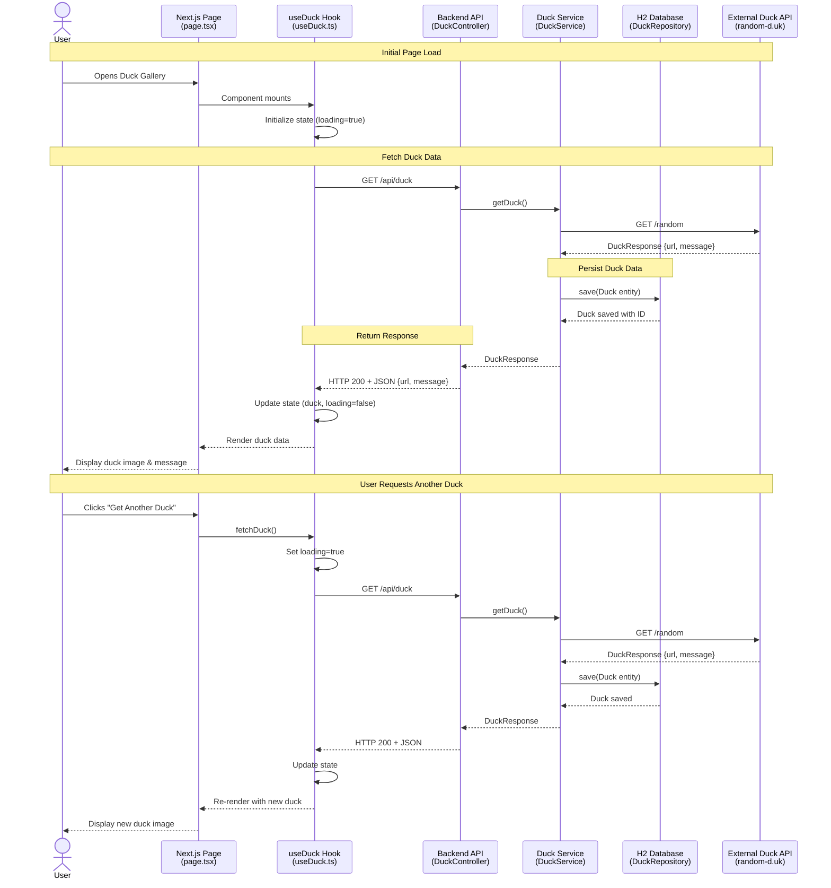

# Duck Gallery - End-to-End Flow Diagram

This document visualizes the complete data flow for the Duck Gallery application, showing interactions between the user, frontend (Next.js), backend (Spring Boot), database (H2), and external API.

## Overview

The Duck Gallery application demonstrates a full-stack flow where:
- Users interact with a Next.js 16 frontend built with React 19
- Frontend communicates with a Spring Boot 4 REST API
- Backend fetches duck images from an external Random Duck API
- Data is persisted in an H2 in-memory database
- Results are displayed to the user with a responsive UI

## Sequence Diagram

## Key Participants

### Frontend Components
- **page.tsx**: Main application page that renders the duck gallery UI
- **useDuck Hook**: Custom React hook managing duck data state, API calls, and loading/error states

### Backend Components
- **DuckController**: REST controller exposing `/api/duck` endpoint with CORS support for frontend
- **DuckService**: Business logic layer that orchestrates external API calls and database persistence
- **DuckRepository**: Spring Data JPA repository for persisting Duck entities

### External Systems
- **H2 Database**: In-memory database storing historical duck records
- **Random Duck API**: External service providing random duck images and messages

## Data Flow Steps

### 1. User Interaction & Component Initialization
- User navigates to the Duck Gallery (`http://localhost:3000`)
- React page component mounts and initializes the `useDuck` hook
- Hook sets initial loading state to `true`
- `useEffect` triggers automatic fetch on mount

### 2. Frontend to Backend Communication
- `useDuck` hook calls `fetchDuck()` function
- Sends HTTP GET request to `http://localhost:8080/api/duck`
- Request passes through CORS validation (allowed origin: `http://localhost:3000`)

### 3. Backend Processing
- `DuckController` receives the request at `@GetMapping /api/duck`
- Controller delegates to `DuckService.getRandomDuck()`
- Service uses `RestClient` to call external Random Duck API at configured URL
- External API returns JSON with duck image URL and message

### 4. Data Persistence
- Service creates a new `Duck` entity with URL and message
- Entity automatically gets `createdAt` timestamp
- `DuckRepository` persists entity to H2 database with auto-generated ID

### 5. Response & UI Update
- Service returns `DuckResponse` record to controller
- Controller returns HTTP 200 with JSON payload
- Frontend hook receives response and updates state
- React component re-renders with new duck data
- UI displays duck image, message, and enables "Get Another Duck" button

### 6. Subsequent Requests
- User can click "Get Another Duck" to repeat the flow
- Each request creates a new database entry
- UI shows loading state during fetch

## Technologies Used

- **Frontend**: Next.js 16 (App Router), React 19, TypeScript, Tailwind CSS 4
- **Backend**: Java 21, Spring Boot 4, Spring Data JPA, RestClient
- **Database**: H2 (in-memory)
- **External Integration**: Random Duck API (random-d.uk)

## Edit This Diagram

You can edit and customize this diagram using the Mermaid Live Editor:

[📝 Edit Diagram in Mermaid Live Editor](https://mermaid.live/edit#pako:eNrNVU2P2jAQ_SujHCqqBljtEbVIC9kCVcUiPm578SYDuCR2ajssFPHfdxw7fJSordQeyim235t5fvNCDkEsEww6EGj8XqCIMeJspVj2LIB-LDZSwUKjcuucKcNjnjNhYDECpmGMO9P6pmHCVvjxRbW7jZyeWkbv3t9ShlJuLKnQGBXxplw7kt8hXg3tYVK26rF4gyKxS0eyjL4URsk0RVVDnKHa8hgtuezn12e236ihRj3LGt5DxAx7YfqCNMVcak7G7Gt4jzvj5dITKsFS1_okWjGRyKyZtIoN0V2BsTQIcovO6tDV6MBIcMOpgPUWvkqWOLTFNLvdBSGechT-bgNmTdh7yIgA1t0O9GWWS4EkLZOFMNoB7NkJ4vvwHwjaMJLSSKkZF6tPRhWVOb9U-hlNvHY6rF9XPUrA4HEObZbzdkIYd0z7dOon0IEVGstv-HZ-nxBVj7KEc89B3EHzsogbj6YLa4RDodIQMtSa_DvW38Izw6jXgQkqzbX5-RpnJRak2RbLFABZyk0Vgah3o6OEJvDKzRpGUX170h-6GUzRFEpAJf66deXi5fXOJp7mOJzPJ3B_dwcf4MvsaVxrwNXgF3lix-2HbkcTQjX6JUt1NfuS5CM3pVeQlFswJCeTFqUMmwlSyXWesr2D8MyG912l4g-yZBfUhf6NtNHwIKRZ00Z0ys1F_PspjzcanoMBmmtkcPMeLG1ELxN25cSMClyG_v9N8N_F8V_k6jdBqotMU7nUlC-DwFc4m1iXnArh0hOEEGSoMsYT-lAdAppyVn6yElyyIjXB8fgGFpEucQ)

---

**Generated**: 2026-01-29  
**Repository**: [ivanlpm/demo-copilot](https://github.com/ivanlpm/demo-copilot)
